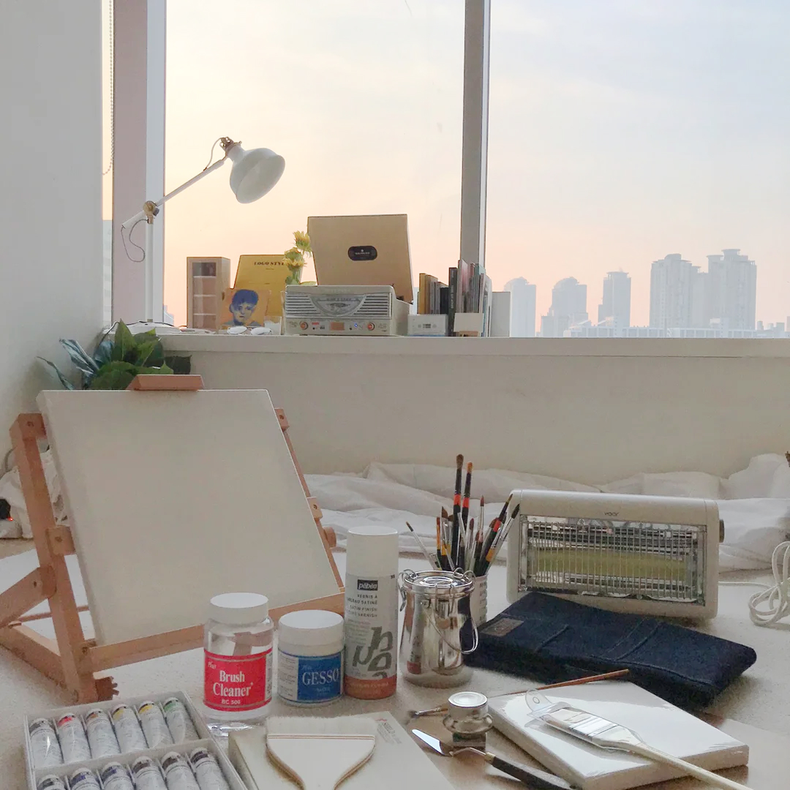

<br />
<br />

<!-- Header -->

<div align="middle" >
  
</div>

<h1 align="middle">The House of Tomorrow</h2>
<p align="middle">Online lifestyle shop made with SASS</p>

<p align="middle">
  
  
  
  
</p>

<!-- <p align="middle"><a href="#">👉 Project link</a></p> -->

<br />
<br />

<!-- Content -->

## 📸 screenshots


<br />
<br />

<h2>❗ Status</h2>

<br />

### 1. Login & Logout Status: 로그인 했을 때 & 로그인 안 했을 때

<br />

### 1-1. GNB

- 로그인 안 했을 때

```html
<div class="button-group">
  <button
    class="gnb-icon-button is-search lg-hidden"
    type="button"
    aria-label="검색 열기 버튼"
  >
    <i class="ic-search"></i>
  </button>
  <a
    class="gnb-icon-button is-cart"
    href="/"
    aria-label="장바구니로 페이지로 이동"
  >
    <i class="ic-cart"></i>
  </a>
  <div class="gnb-auth sm-hidden">
    <a href="/">로그인</a>
    <a href="/">회원가입</a>
  </div>
</div>
```

<br />

- 로그인 했을 때

```html
<div class="button-group">
  <button
    class="gnb-icon-button is-search lg-hidden"
    type="button"
    aria-label="검색 열기 버튼"
  >
    <i class="ic-search"></i>
  </button>

  <a
    class="gnb-icon-button sm-hidden"
    href="/"
    aria-label="스크랩북 페이지로 이동"
  >
    <i class="ic-bookmark"></i>
  </a>

  <a
    class="gnb-icon-button sm-hidden"
    href="/"
    aria-label="내 소식 페이지로 이동"
  >
    <i class="ic-bell"></i>
  </a>

  <a
    class="gnb-icon-button is-cart"
    href="/"
    aria-label="장바구니로 페이지로 이동"
  >
    <i class="ic-cart"></i>
    <strong class="badge" aria-label="장바구니에 상품이 5개 담겨 있습니다"
      >5</strong
    >
  </a>

  <button
    class="gnb-avatar-button sm-hidden"
    type="button"
    aria-label="마이 메뉴 열기 버튼"
  >
    <div class="avatar-32">
      
    </div>
  </button>
</div>
```

<br />
<br />

### 1-2. Sidebar

#### 1-2-1. User avatar & user name

- 로그인 했을 때

```html
<div class="sidebar-user">
  <a href="/">
    <div class="avatar-24">
      
    </div>
    <strong class="user-name">
      조지 거슈윈 조지 거슈윈 조지 거슈윈 조지 거슈윈 조지 거슈윈 조지 거슈윈
    </strong></a
  >
</div>
```

- 로그인 안 했을 때

```html
<div class="sidebar-auth">
  <a href="/" class="btn-outlined btn-40">로그인</a>
  <a href="/" class="btn-fill-primary btn-40">회원가입</a>
</div>
```

#### 1-2-2. My menu

- 로그인 했을 때

```html
<div class="sidebar-menu-my">
  <ul class="sidebar-menu-my-list">
    <li class="sidebar-menu-my-list-item">
      <a href="/">마이페이지</a>
    </li>
    <li class="sidebar-menu-my-list-item">
      <a href="/">나의 쇼핑</a>
    </li>
    <li class="sidebar-menu-my-list-item">
      <a href="/">스크랩북</a>
    </li>
    <li class="sidebar-menu-my-list-item">
      <a href="/">알림</a>
    </li>
    <li class="sidebar-menu-my-list-item">
      <a href="/">이벤트 </a>
    </li>
  </ul>
</div>
```

- 로그인 안 했을 때: none

  <br />
  <br />

### 2. Review

- Review 없을 때

```html
<section
  class="product-section product-review"
  id="product-review"
  role="tabpanel"
>
  <header class="product-section-header">
    <h1 class="title">리뷰</h1>
    <strong class="badge" aria-label="0개">0</strong>
    <a class="text-button" href="/">리뷰쓰기</a>
  </header>

  <div class="product-section-content">
    <p class="review-empty">
      첫 리뷰를 남겨주세요! <br />
      최대 <strong>500P</strong>를 드립니다.
    </p>
  </div>
</section>
```

- Review 있을 때

```html
<section
  class="product-section product-review"
  id="product-review"
  role="tabpanel"
>
  <header class="product-section-header">
    <h1 class="title">리뷰</h1>
    <strong class="badge" aria-label="566개">566</strong>
    <a class="text-button" href="/">리뷰쓰기</a>
  </header>

  <div class="product-section-content">
    <div class="review-scoreboard">
      <div class="score-summary">
        <strong class="average-score" aria-label="평점 4.8">4.8</strong>
        <div class="star-rating">
          <i class="ic-star is-active"></i>
          <i class="ic-star is-active"></i>
          <i class="ic-star is-active"></i>
          <i class="ic-star is-active"></i>
          <i class="ic-star is-active"></i>
        </div>
      </div>

      <div class="score-detail">
        <dl class="score-stats-list">
          <div class="score-stats-item is-active">
            <dt>5점</dt>

            <dd>
              <div class="bar-graph" aria-hidden="true">
                <div class="active-bar"></div>
              </div>
              <strong class="count" aria-label="467명">467</strong>
            </dd>
          </div>

          <div class="score-stats-item">
            <dt>4점</dt>

            <dd>
              <div class="bar-graph" aria-hidden="true">
                <div class="active-bar"></div>
              </div>
              <strong class="count" aria-label="87명">87</strong>
            </dd>
          </div>

          <div class="score-stats-item">
            <dt>3점</dt>

            <dd>
              <div class="bar-graph" aria-hidden="true">
                <div class="active-bar"></div>
              </div>
              <strong class="count" aria-label="13명">13</strong>
            </dd>
          </div>

          <div class="score-stats-item">
            <dt>2점</dt>
            <dd>
              <div class="bar-graph" aria-hidden="true">
                <div class="active-bar"></div>
              </div>
              <strong class="count" aria-label="0명">0</strong>
            </dd>
          </div>

          <div class="score-stats-item">
            <dt>1점</dt>

            <dd>
              <div class="bar-graph" aria-hidden="true">
                <div class="active-bar"></div>
              </div>
              <strong class="count" aria-label="0명">0</strong>
            </dd>
          </div>
        </dl>
      </div>
    </div>

    <ol class="review-list">
      <li class="review-item">
        <article class="review-card">
          <header class="review-card-header">
            <h3 class="visually-hidden">맥모닝불여일견 님이 작성한 리뷰</h3>

            <a class="avatar-24" href="/">
              
            </a>

            <div class="info">
              <a class="username" href="/"><strong>맥모닝불여일견</strong></a>

              <div class="detail">
                <div class="star-rating-13" aria-label="5.0점 중에 5.0점">
                  <i class="ic-star is-active"></i>
                  <i class="ic-star is-active"></i>
                  <i class="ic-star is-active"></i>
                  <i class="ic-star is-active"></i>
                  <i class="ic-star is-active"></i>
                </div>

                <div class="misc">
                  <time>2021.01.01</time>
                  <span>오늘의집 구매</span>
                </div>
              </div>
            </div>
          </header>

          <div class="review-card-body">
            <p>
              집 전체를 데운다기보다는 틀어놓고 앞에 앉아있으면 따땃해지는
              정도예요. 불 꺼놓고 난로 켜고 담요 덮은 채로 커피 마시면 아주
              좋아요. 고양이도 좋아해요
            </p>
          </div>

          <footer class="review-card-footer">
            <button class="btn-outlined btn-32" type="button">
              도움이 돼요
            </button>

            <p>
              <strong><span>7</span>명</strong>에게 도움이 되었습니다.
            </p>
          </footer>
        </article>
      </li>

      <!-- NOTE: Review Image ❌ -->
      <li class="review-item">
        <article class="review-card">
          <header class="review-card-header">
            <h3 class="visually-hidden">
              슈크림 도어가 열립니다 님이 작성한 리뷰
            </h3>

            <a
              class="avatar-24"
              href="/"
              aria-label="슈크림 도어가 열립니다 님의 프로필로 이동"
            >
            </a>

            <div class="info">
              <a class="username" href="/"
                ><strong>슈크림 도어가 열립니다</strong></a
              >

              <div class="detail">
                <div class="star-rating-13" aria-label="5.0점 중에 5.0점">
                  <i class="ic-star is-active"></i>
                  <i class="ic-star is-active"></i>
                  <i class="ic-star is-active"></i>
                  <i class="ic-star is-active"></i>
                  <i class="ic-star"></i>
                </div>

                <div class="misc">
                  <time>2021.01.01</time>
                  <span>오늘의집 구매</span>
                </div>
              </div>
            </div>
          </header>

          <div class="review-card-body">
            <p>
              온도 조절과 타이머가 안 된다는 걸 뒤늦게 알았지만 이쁘니까 대만족!
              가격도 대만족!
            </p>
          </div>

          <footer class="review-card-footer">
            <button class="btn-outlined btn-32" type="button">
              도움이 돼요
            </button>

            <p>
              <strong><span>7</span>명</strong>에게 도움이 되었습니다.
            </p>
          </footer>
        </article>
      </li>

      <!-- NOTE: Review Image ⭕️ -->
      <li class="review-item">
        <article class="review-card">
          <header class="review-card-header">
            <h3 class="visually-hidden">할부로 애틋하게 님이 작성한 리뷰</h3>

            <a class="avatar-24" href="/">
              
            </a>

            <div class="info">
              <a class="username" href="/"><strong>할부로 애틋하게</strong></a>

              <div class="detail">
                <div class="star-rating-13" aria-label="5.0점 중에 5.0점">
                  <i class="ic-star is-active"></i>
                  <i class="ic-star is-active"></i>
                  <i class="ic-star is-active"></i>
                  <i class="ic-star is-active"></i>
                  <i class="ic-star is-active"></i>
                </div>

                <div class="misc">
                  <time>2021.01.01</time>
                  <span>오늘의집 구매</span>
                </div>
              </div>
            </div>
          </header>

          <div class="review-card-body">
            <div class="review-image">
              
            </div>
            <p>
              작업실에서 손이 시려워서 책상 위에 올려서 쓸걸로 골랐습니다!
              아주아주 뜨듯하고 크기도 적당하고 민트 사고싶엇지만 품절 ㅠㅠ
            </p>
          </div>

          <footer class="review-card-footer">
            <button class="btn-outlined btn-32" type="button">
              도움이 돼요
            </button>

            <p>
              <strong><span>7</span>명</strong>에게 도움이 되었습니다.
            </p>
          </footer>
        </article>
      </li>

      <!-- NOTE: Button Pressed: True, Helped number ≥ 1 -->
      <li class="review-item">
        <article class="review-card">
          <header class="review-card-header">
            <h3 class="visually-hidden">태정태세비욘세 님이 작성한 리뷰</h3>

            <a class="avatar-24" href="/">
              
            </a>

            <div class="info">
              <a class="username" href="/"><strong>태정태세비욘세</strong></a>

              <div class="detail">
                <div class="star-rating-13" aria-label="5.0점 중에 5.0점">
                  <i class="ic-star is-active"></i>
                  <i class="ic-star is-active"></i>
                  <i class="ic-star is-active"></i>
                  <i class="ic-star is-active"></i>
                  <i class="ic-star is-active"></i>
                </div>

                <div class="misc">
                  <time>2021.01.01</time>
                  <span>오늘의집 구매</span>
                </div>
              </div>
            </div>
          </header>

          <div class="review-card-body">
            <p>
              오래된 아파트 확장된 방이라 외풍이 너무 심해 급하게 구매했습니다!
              예약배송이라 10일 가까이 기다렸는데 너무너무 만족스러워요~ :) 방이
              큰 편이라 전체가 다 따뜻해지길 바라지도 않았고, 후기를 먼저
              봤던터라 크게 기대를 안햇었는데 기대 이상입니다. 틀어놓으면 확실히
              방 공기가 달라져요! 후끈!!! 까진 아니어도 차가운 공기가
              따뜻해집니다~ 만족스러워요!!! 올 겨울 덕분에 떨지 않고 보낼 수
              있을것 같습니당
            </p>
          </div>

          <footer class="review-card-footer">
            <button class="btn-fill-primary btn-32" type="button">
              <i class="ic-check" aria-hidden></i>
              도움됨
            </button>

            <p>
              <strong><span>2</span>명</strong>에게 도움이 되었습니다.
            </p>
          </footer>
        </article>
      </li>

      <!-- NOTE: Button Pressed: False, Helped number = 0 -->
      <li class="review-item">
        <article class="review-card">
          <header class="review-card-header">
            <h3 class="visually-hidden">인투디얼은논 님이 작성한 리뷰</h3>

            <a class="avatar-24" href="/">
              
            </a>

            <div class="info">
              <a class="username" href="/"><strong>인투디얼은논</strong></a>

              <div class="detail">
                <div class="star-rating-13" aria-label="5.0점 중에 5.0점">
                  <i class="ic-star is-active"></i>
                  <i class="ic-star is-active"></i>
                  <i class="ic-star is-active"></i>
                  <i class="ic-star"></i>
                  <i class="ic-star"></i>
                </div>

                <div class="misc">
                  <time>2021.01.01</time>
                  <span>오늘의집 구매</span>
                </div>
              </div>
            </div>
          </header>

          <div class="review-card-body">
            <p>가격 대비 만족합니다.</p>
          </div>

          <footer class="review-card-footer">
            <button class="btn-outlined btn-32" type="button">
              도움이 돼요
            </button>
          </footer>
        </article>
      </li>
    </ol>

    <div class="pagination">
      <!-- <button class="page-control page-prev">
                  <i class="ic-chevron"></i>
                </button> -->
      <ol class="page-list">
        <li class="page-item is-active">
          <a href="/">1</a>
        </li>
        <li class="page-item">
          <a href="/">2</a>
        </li>
        <li class="page-item">
          <a href="/">3</a>
        </li>
        <li class="page-item">
          <a href="/">4</a>
        </li>
        <li class="page-item">
          <a href="/">5</a>
        </li>
      </ol>
      <button class="page-control page-next">
        <i class="ic-chevron"></i>
      </button>
    </div>
  </div>
</section>
```

<br />
<br />

<!-- Todo list -->

### 👀 Todo list

- [x] Base
  - [x] Reset & Normalise CSS
  - [x] Prepare assets
- [x] Variables
- [x] Mixins
- [x] Modules
- [ ] Components
  - [x] GNB
  - [x] Sidebar
  - [x] Search Modal
  - [x] Search History
  - [x] LNG
  - [x] Global Footer
  - [x] Breadcrumb & Product Carousel
  - [x] Product Info & Order Form
  - [x] Page Structure & Shared Components
  - [ ] 🚧 Product Section
  - [ ] Order Forms
  - [ ] Dialogs
- [ ] Javascript
